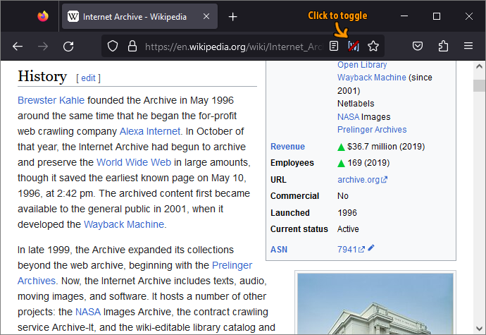
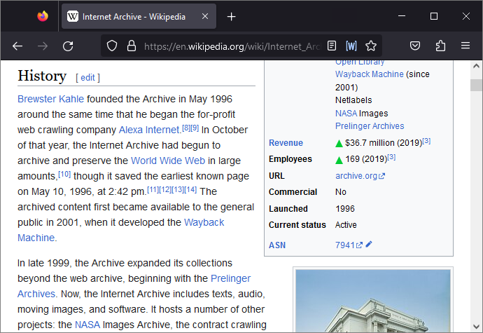
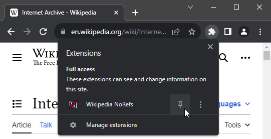

# Wikipedia NoRefs web extension

This is a simple extension for hiding and showing wikipedia reference/citation markers.

By default the extension hides citation markers in articles to improve Wikipedia article readability. For the few times you actually want to check a reference, just click the extension icon and they will reappear.

_Note: the extension only activates and appears on wikipedia wiki pages, so if you're not seeing it, visit [such a page](https://en.wikipedia.org/wiki/Internet_Archive)._

## Howto use

When visiting a wikipedia page after installation, citation markers are hidden by default. Whether citations are shown or hidden is reflected in the extension's icon. A line across the icon means markers are hidden. No line, they are shown. Aside from the icon indication, just reading the wiki page should make it obvious which mode is active.

## Firefox

The extension icon is shown to the right in the address bar, since the extension only applies to wiki pages and isn't a universal extension.

## Chrome

The extension icon is shown among all the other extensions, since unfortunately the Chrome team decided to remove the address bar display of extensions that only act on certain pages. In chrome the extension will be shown as disabled (grayed out) when visiting non-wikipedia pages.

Tip is to pin the extension, since it'll get rather annoying having to expand the _bag of extensions_ icon every time you want to toggle citation markers.

## Privacy

Does not send nor retrieve any data, so does not affect Wikipedia browsing privacy.
